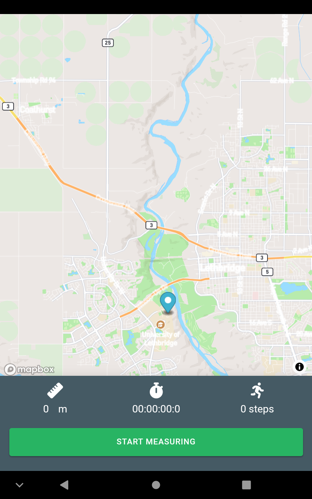

# Stride

Assignment 2 in NMED 3630: Mobile Application Development
 
Click here to view [exercise](./docs/MobileApp-AssignmentTwo.pdf) description.

## Minimum requirements:
You should have node, npm, cordova, and Android studio already installed

## Steps to run the project
  1. Clone the repo
  2. Enter `cd Stride`
  3. `npm i` to install dependencies
 
 ### To run locally on the browser
  4. `npm run start` to compile the components
 
 ### To run locally on the emulator
  4. `npm run install-cordova-dev` to install cordova dependencies, plugins, and add android as a platform
  5. `npm run build-cordova` to compile components as cordova-based
  6. `npm run emulate` to run the emulator

### To run on the connected device
  6. connect the android device
  7. cd to `cordova` and run `npx cordova run android`
   
### To deploy for production
  1. `npm run build`

Pedometers like Fitbit and Apple Health have been widely used apps to track the number of steps taken by a person throughout a certain period. With the popularity of pedometers, I have created my own version called Stride. Stride uses the accelerometer api to estimate the number of steps taken by the user. It also uses the geolocation plugin to track user movement and to measure his distance from the original position to his current position.

